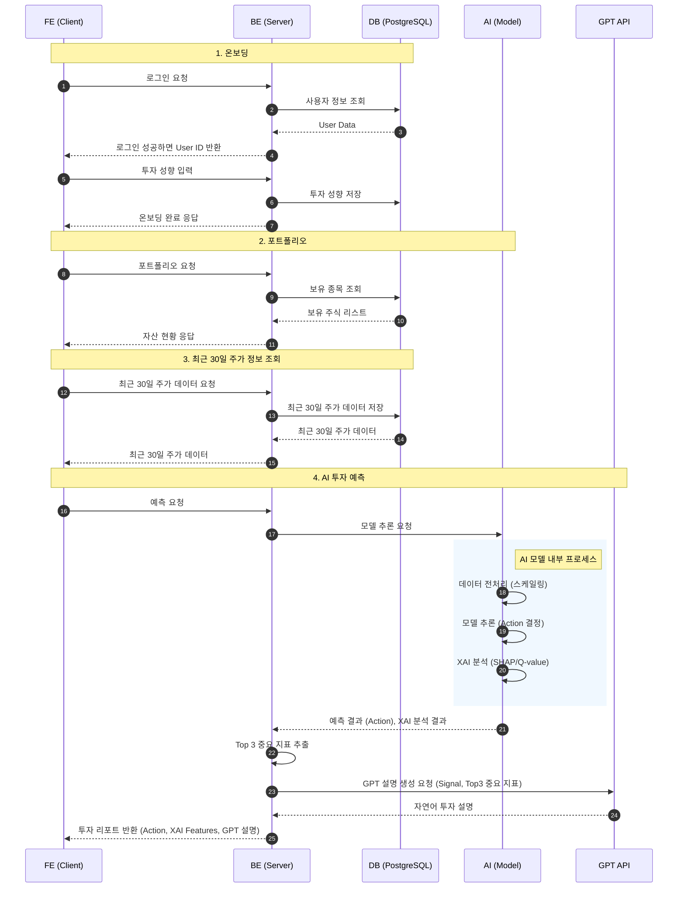

# Libri: AI 기반 주식 투자 어시스턴트

**Libri**는 개인화된 주식 추천 및 설명 가능한 AI(XAI) 인사이트를 제공하는 지능형 주식 투자 비서 플랫폼입니다. 사용자의 투자 성향을 분석하여 가장 적합한 AI 모델(A2C 또는 MARL)을 선정하고, GPT-4와 SHAP 값을 활용해 신뢰할 수 있는 매매 신호와 상세한 설명을 제공합니다.

---

## 🚀 주요 기능

### 1. **개인 맞춤형 투자 전략**
- **공격형 투자 (A2C 모델)**: 단일 에이전트 이점 행위자-비평가(A2C) 모델을 활용하여, 위험을 감수하더라도 높은 수익률을 추구합니다.
- **안정형 투자 (MARL 모델)**: 다중 에이전트 강화학습(MARL) 접근 방식을 통해 안정성과 리스크 관리를 최우선으로 합니다.

### 2. **AI 기반 종목 추천**
- 추가한 종목에 대한 일일 매매 신호(**매수**, **매도**, **관망**)를 제공합니다.
- 고도화된 강화학습(RL) 기술을 적용하여 시장 상황 변화에 능동적으로 대응합니다.

### 3. **설명 가능한 AI (XAI) 및 GPT 인사이트**
- **SHAP 분석**: MACD, RSI 등 AI의 의사결정에 영향을 미친 핵심 기술적 지표를 시각화하여 보여줍니다.
- **자연어 설명**: OpenAI의 GPT-4를 연동하여 복잡한 모델의 분석 결과를 이해하기 쉬운 투자 조언으로 변환해 제공합니다.

### 4. **AI 거래 내역**
- **모의 투자**: AI 추천에 따른 가상 거래를 시뮬레이션하여, 금전적 위험 없이 AI의 투자를 따라했을 때의 예상 수익률을 확인할 수 있습니다.
- **성과 추적**: 시간 경과에 따른 수익/손실 및 승률 통계를 시각적으로 제공합니다.

### 5. **종합 대시보드**
- **포트폴리오 관리**: 현재 보유 종목, 초기 투자금, 실시간 자산 평가액을 한눈에 파악할 수 있습니다.
- **시각화**: `lightweight-charts`를 활용한 인터랙티브 차트로 주가 추이를 직관적으로 보여줍니다.

---

## 🛠️ 기술 스택 (Tech Stack)

### **Frontend (FE)**
- **Framework**: [React](https://react.dev/) + [Vite](https://vitejs.dev/)
- **Language**: [TypeScript](https://www.typescriptlang.org/)
- **Styling**: [Tailwind CSS](https://tailwindcss.com/)
- **UI Components**: [Radix UI](https://www.radix-ui.com/)
- **Charting**: [Lightweight Charts](https://tradingview.github.io/lightweight-charts/)

### **Backend (BE)**
- **Framework**: [FastAPI](https://fastapi.tiangolo.com/)
- **Language**: Python 3.9+
- **Database**: SQLAlchemy (ORM) + SQLite (개발용)
- **Migrations**: Alembic

### **AI & Data Analysis**
- **Deep Learning**: [PyTorch](https://pytorch.org/)
- **Reinforcement Learning**: A2C, MARL (Multi-Agent RL)
- **XAI**: [SHAP](https://shap.readthedocs.io/)
- **LLM**: OpenAI API (GPT-4)
- **Data Fetching**: `yfinance` (Yahoo Finance API)

---

## � 시스템 흐름도 (System Flow)

사용자가 종목 분석을 요청할 때의 내부 처리 과정은 다음과 같습니다.



---

## 📂 프로젝트 구조

```bash
.
├── AI/                 # AI 모델 학습 및 추론 스크립트
│   ├── a2c_single_agent/   # A2C 모델 구현
│   ├── marl_3agent/        # MARL 모델 구현
│   └── ...
├── BE/                 # 백엔드 API 서버
│   ├── app/                # 메인 애플리케이션 코드
│   │   ├── routers/        # API 엔드포인트 (ai, portfolio, users 등)
│   │   ├── models.py       # DB 모델 정의
│   │   └── ai_wrapper.py   # AI 추론 모듈 통합
│   ├── alembic/            # DB 마이그레이션 관리
│   └── requirements.txt    # BE 의존성 목록
└── FE/                 # 프론트엔드 웹 애플리케이션
    ├── src/
    │   ├── components/     # UI 컴포넌트
    │   ├── pages/          # 페이지 레이아웃
    │   └── ...
    └── package.json        # FE 의존성 목록
```

---

## 🌐 배포 사이트 (Live Demo)

현재 서비스가 배포되어 운영 중입니다. 아래 링크를 통해 바로 서비스를 이용해보실 수 있습니다.

**🔗 [Libri 서비스 바로가기](https://libri-23e87.web.app/)**

---
